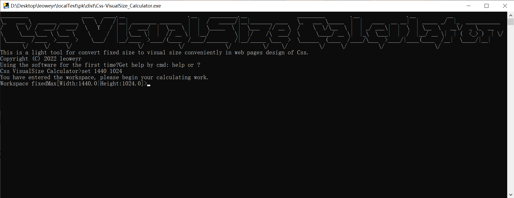
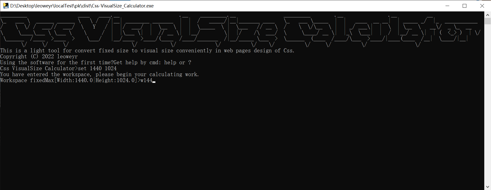
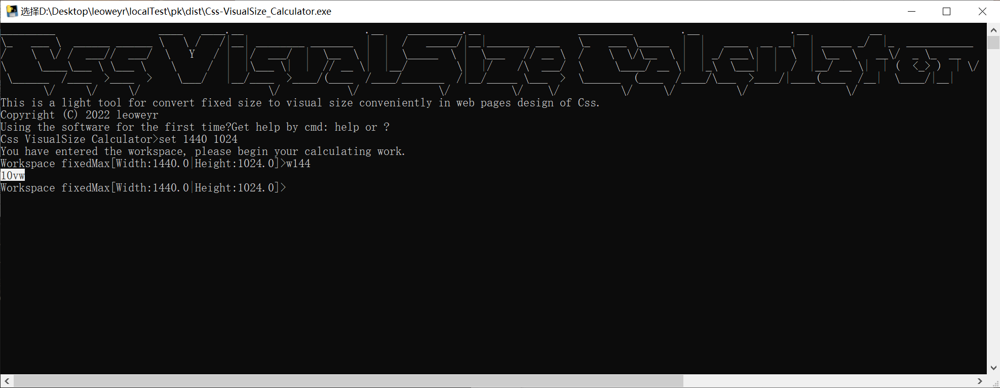

# Css-VisualSize_Calculator - Converts fixed size to viewport size by lite way for web design aids.

##### English | [简体中文](README_zh-cn.md)

Do you have the same confusion as me? That is, when numerical processing is performed in Css web design, the fixed size is calculated as the viewport size, and use the `Calculator` software to tap the symbols one by one **it feels very hard to pinch**, even with full keyboard operations such as `Powershell`, some **steps are redundant**.

But now you can say goodbye to the frustrating times of the past!

## 💎Advantage

- Pure command line interface & full keyboard operation

  

- The maximum value of the viewport size is preset in advance, not need to repeatedly substitute

  

- More direct numerical input

  

- Copy and paste the formatted result where you need it

  

## 🤝Help

Type `help` or `?` in ` Css-VisualSize_Calculator` for **full and friendly help**.