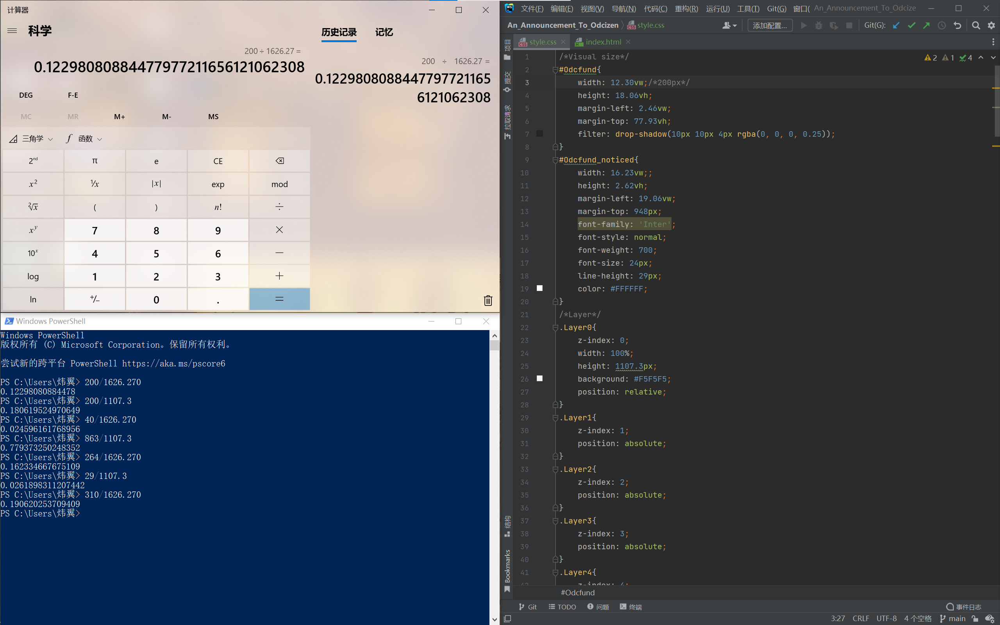
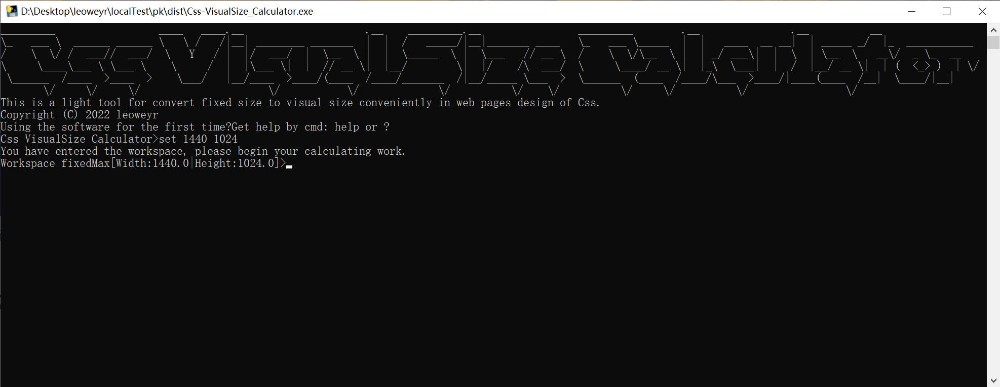
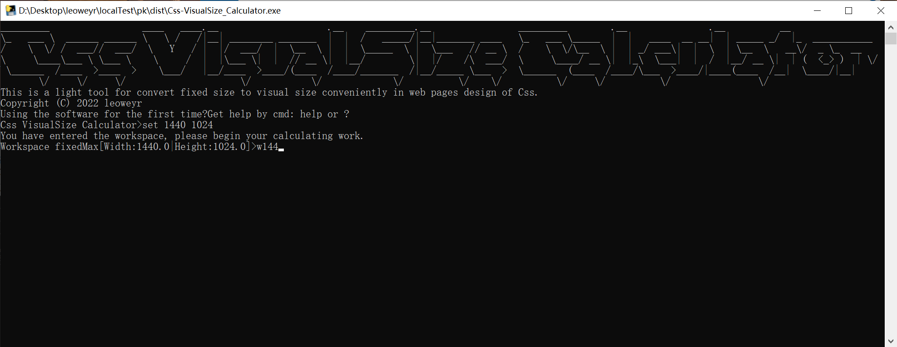
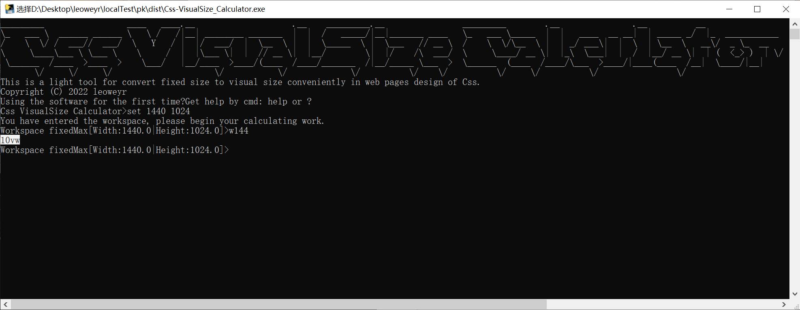

# Css视窗尺寸计算器 - 将固定尺寸转化成视窗尺寸的网页设计辅助轻量工具

##### [English](https://github.com/leoweyr/Css-VisualSize_Calculator) | 简体中文

您是否和我一样有同一个困惑？就是在Css网页设计中进行数值处理时，将固定尺寸计算成视窗尺寸，使用`计算器`软件一个个符号去敲**感觉很别捏**，就算使用`Powershell`等全键盘操作进行计算还是有些**步骤显得重复冗余**

但现在您可以跟过去憋屈的时代告别啦！

## 💎优势

- 纯命令行界面 & 全键盘操作

  

- 预先设定视窗尺寸最大值，不用反复代入

  

- 更直接的数值输入

  

- 将格式化后的结果复制粘贴到您需要的地方

  

## 🤝帮助

在` Css视窗尺寸计算器` 中输入`help`或`?`获得**全面且友善的帮助**
